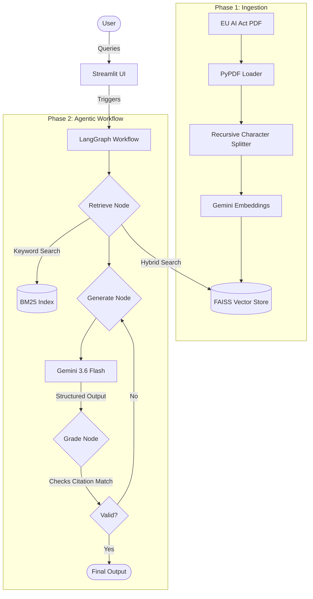

# Grounded Citation RAG (EU AI Act Compliance Assistant)

**Live Demo:** [https://citation-rag.streamlit.app/](https://citation-rag.streamlit.app/)

## Overview
Grounded Citation RAG is an AI-powered legal compliance assistant tailored for querying the EU AI Act. It utilizes an advanced agentic workflow to ensure high-fidelity, zero-hallucination responses by grounding every answer with an exact, word-for-word citation from the source legal document.

## Architecture & Workflow

## How It Works
The system is built on a **LangGraph Agentic Workflow** and follows a strict, self-correcting pipeline:
1. **Hybrid Retrieval:** Scans legal texts using both Semantic Search (FAISS) and Keyword Search (BM25) simultaneously for highly relevant context gathering.
2. **Strict Generation:** Utilizes the Google Gemini API to analyze the retrieved chunks and formulate an answer strictly based on the text.
3. **Autonomous Grader (Self-Correction):** A validation node ensures the generated citation is a perfect word-for-word match to the original PDF. If a hallucination or mismatch is detected, the graph routes backward, prompting the AI to correct itself (up to a defined retry limit) before finalizing the output.

## Why It Is Developed
Large Language Models (LLMs) are prone to hallucinations, which is unacceptable in legal, medical, and compliance domains where precision is critical. This project was developed to demonstrate a robust architecture that strictly binds the AI to the provided documents, ensuring trustworthy, verifiable, and exact answers without making up information.

## Where It Can Be Used
- **Legal & Compliance:** Analyzing complex regulations (like the EU AI Act), contracts, and corporate policies.
- **Healthcare & Medicine:** Querying medical guidelines, clinical trial protocols, and patient records.
- **Finance & Audit:** Reviewing financial reports, regulatory filings, and tax laws.
- **Enterprise Knowledge Base:** Internal document search where accuracy and source verification are paramount.

## Future Scopes
- **Multi-Document Support:** Expanding the RAG capabilities to handle vast libraries of interconnected documents across various domains.
- **Advanced Graph Capabilities:** Introducing multi-agent workflows for summarization, contradictory clause detection, and comparative analysis.
- **Dynamic Data Ingestion:** Allowing users to upload their own custom PDFs/documents directly via the UI for on-the-fly grounded RAG processing.
- **Extended Evaluation Metrics:** Integrating LLM-as-a-judge metrics for assessing the fluency, helpfulness, and comprehensiveness of the answers beyond exact citation matching.
